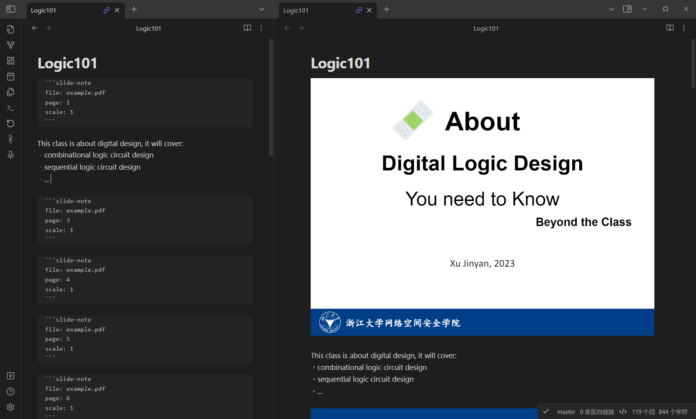
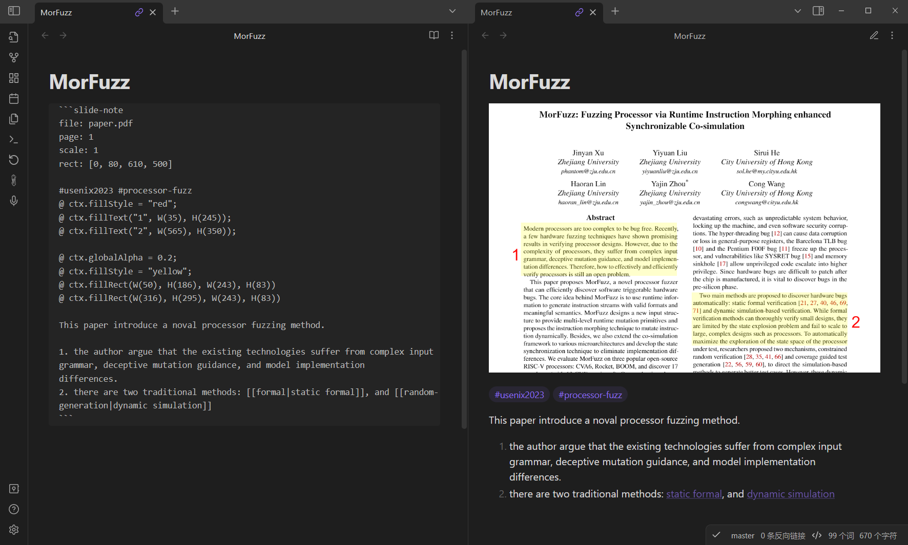

# Obsidian Slide Note

[](https://www.buymeacoffee.com/Phantom1003)

This repository maintains an Obsidian plugin that can help you take notes for your classes more easily.

With this plugin you can write plaintext notes, and:

- keep binding with the slides
- render the slide and your graphic annotations together
- make your notes decouple with the heavy tools

This plugin is inspired by the [better-pdf](https://github.com/MSzturc/obsidian-better-pdf-plugin), but beyond rendering PDF pages.
Slide Note provides several new features, including:

- graphic annotation support
- per-file frontmatter configuration
- performance optimization for the huge number of pages
- automatic rerender when the pdf file has been modified

### Notice
> Slide Note is still under development, and some of the usages may have incompatible modifications. 
>
> In addition, Slide Note will only be compatible with the latest non-internal version. 

## 1 Usage

### 1.1 Basic Fields

You can involve Slide Note by writing a code block with the `slide-note` type.

`````markdown
```slide-note
file: example.pdf
page: 2, 4-5, 8
scale: 0.2
dpi: 2
text: true
rotat: 90
rect: W(0.069), H(0.113), W(0.861), H(0.337)
```
`````



#### 1.1.1 `file` Field

The `file` field is the relative path of your file, use the `/` symbol as the path separator.
This is a mandatory field when there is no default value.

For example, if you have a file named `example.pdf` in the `slide` directory, you can use either of the following methods to specify this file:

```markdown
file: slide/example.pdf
file: example.pdf
file: [[example.pdf]]
```

This field also supports the absolute path. But we don't suggest you use the relative path, please use the obsidian built-in link name, using the relative path may produce unexpected behaviors. 

#### 1.1.2 `page` Field

You can use `page` field to specify the pages you want to render.
By default, all pages in the PDF will be rendered.
This field supports continuous page rendering, and you can use `-` to specify a page range.
Also, you can enter multiple groups of pages, using `,` to separate them.

```markdown
page: 2, 4-5, 8
```

#### 1.1.3 `scale` Field

You may want to control the size of the rendering block.
Use the `scale` field for scaling, the default value is 1.0.

#### 1.1.4 `dpi` Field

Sometimes you may feel that the rendered page is a bit blurry, you can use the dpi field to adjust the resolution.
The default DPI level is 1.

#### 1.1.5 `text` Field

Since the PDF pages are rendered as HTML canvas elements, You cannot select the text on the page.
Enable the `text` field to allow you to select them.
The default value is false.

#### 1.1.6 `rotat` Field

You can also rotate your page with the `rotat` field.
The value of this field must be a multiple of 90 degrees, the default value is 0

Notice this field is not compatible with the `text` field.

#### 1.1.6 `rect` Field

The `rect` field can help you render only a part of the page.
This field receives four parameters which are the x and y coordinates of the upper left corner of the render window, and the width and height of the render window.
For simplicity, each parameter is presented as a percentage.
For example, W(0.5) represents 50% of the width.
The default render window is the entire page.

```markdown
rect: W(0.069), H(0.113), W(0.861), H(0.337)
```

Notice this field is not compatible with the `text` field.

### 1.2 File Front Matter

You can overwrite the above default value by writing a front matter in the front of your note file.
```markdown
---
default_file: example.pdf
default_text: true
default_scale: 0.8
default_dpi: 2
default_rotat: 90
---
```

### 1.3 Advanced Annotations

#### 1.3.1 Graphic Annotations

Besides these basic uses, you can also append more statements in the block to annotate the PDF.
A string starting with @ is a graphic annotation.
Slide Note provides a drawboard view to help you to generate the above code.
Double-click the slide page will launch the drawboard on the right side.
You can add path, line, rectangle, and text on the slide.
Once you finish your annotations, click the save button to generate the code that is used to render your annotations.

Notice this feature needs to be turned on manually in the settings.

#### 1.3.2 Inline Notes

And all the other statements will be treated as your notes, this makes sure that all your notes bind with the page in one block.
Therefore, when you link them in other places, you can get them all.

In the end, your notes should look like the following:




### 1.4 `Better PDF` Compatibility
This plugin is compatible with a subset of the features [better-pdf](https://github.com/MSzturc/obsidian-better-pdf-plugin) offers.

If you wish to display your old `better-pdf` notes, you can do so by enabling the "Support Better PDF Code Blocks" setting in the plugin settings.

More information on the better-pdf syntax can be found [here](https://github.com/MSzturc/obsidian-better-pdf-plugin#syntax).

It is not recommended that you continue to use the `better-pdf` syntax, as it is not guaranteed to be compatible with future versions of Slide Note.
Try to migrate to the new syntax as soon as possible.

While using the `better-pdf` syntax, some slide note features won't be available.

| Better PDF Field Name | Supported by Slide Note                                                                           |
| ------------------ | ------------------------------------------------------------------------------------------------- |
| url                | ⚠️Partial, name.pdf subfolder/name.pdf and "[[filename.pdf]]" are supported, urls aren't supported |
| link               | ❌                                                                                                 |
| page               | ✅                                                                                                 |
| range              | ✅                                                                                                 |
| scale              | ✅                                                                                                 |
| fit                | ❌                                                                                                 |
| rotation           | ✅                                                                                                 |
| rect               | ✅                                                                                                 |

### 1.5 Slide Note Block Generator

You will find an item called `Slide Note Block Generation` on your left sidebar.
You can use this generator to insert a bunch of blocks into your current active file.
To generate blocks, you first need to specify a file to open.
You can specify the PDF file to open by:

1. selecting a Slide Note code block.
2. setting a `default_file` property in the front matter.

And then click the icon in the left sidebar, input the pages you want to insert.
Notice when you select a block to specify the file to open, the generated blocks will replace your selection.

### 1.6 Slide Note Quick Open

You may still want to use your PDF viewer to edit your slides.
You also need to specify a PDF file to open.
You can use one of the following methods:

1. select a Slide Note code block.
2. move the cursor to the line containing the `file` field in the SlideNote block.
3. set a `default_file` property in the front matter.

After confirming the file to open, you can right-click the selection/line/editor and select `Slide Note: open with local application`.
